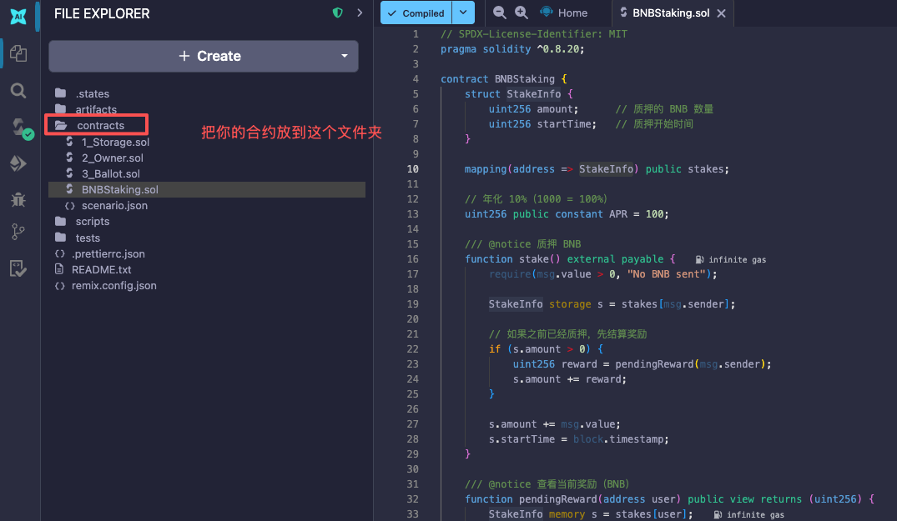
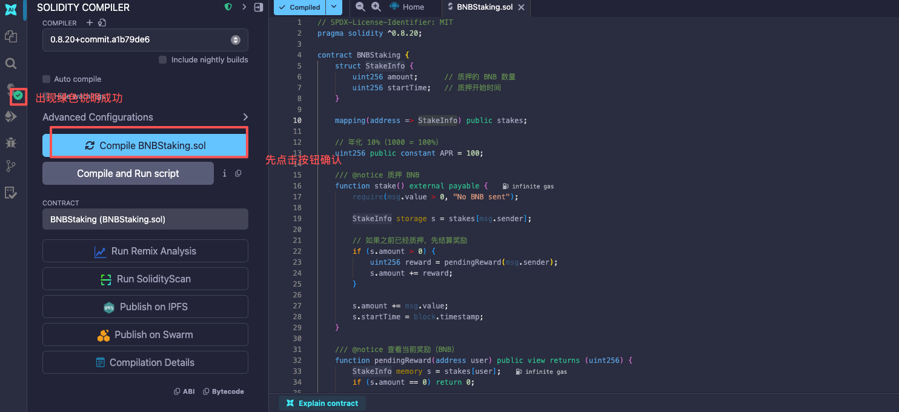
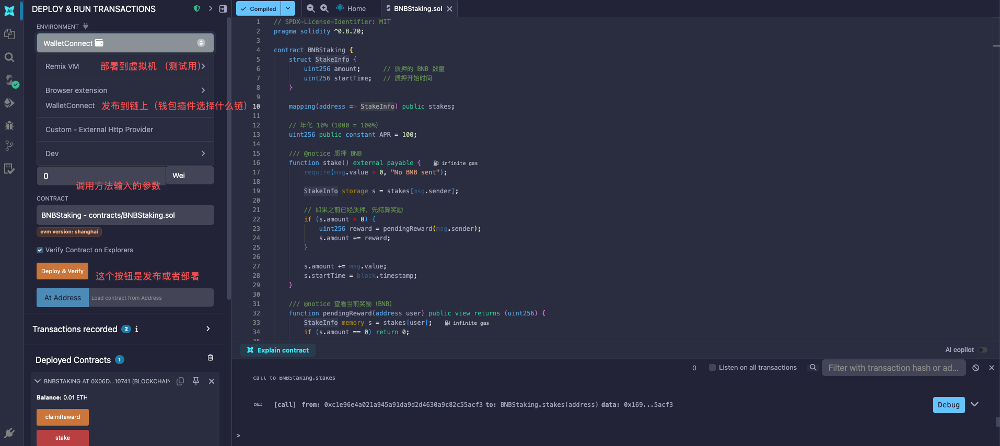

# solidy-demo
solidy的一些学习demo

#### 第一步

#### 第二步

#### 第三步

####  注意：
####  1. Erc20Staking.sol合约：Deploy部署的时候需要选择Contract -> TokenStaking，而不是 Contract -> Erc20Staking
####  2. 部署完成之后合约开源，即可通过连接钱包调用合约方法

开发阶段可以使用内置编辑器：https://remix.ethereum.org

#### 例子：
##### 1. 已部署的Erc20Staking合约地址：https://testnet.bscscan.com/address/0x88d1ac4efad7dafe401c4b2568c5a59b4d7c708a#readContract
##### 2. 已部署的代币合约地址：https://testnet.bscscan.com/address/0xC405AE735Ad770f62bC9719395e817867F208b72#writeContract